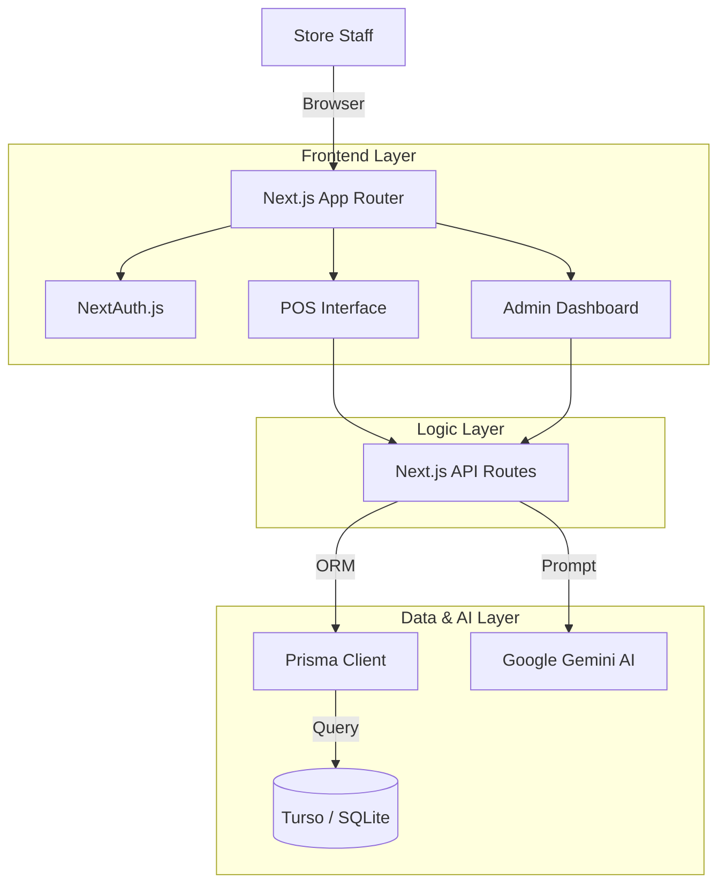

# AI Integrated POS System


A production-grade **Point of Sale (POS) System** engineered for speed and intelligence. 
It combines a lightning-fast cashier interface with an **AI-powered Admin Dashboard** that provides actionable inventory insights.

> **Live Demo**: [LINK_TO_YOUR_CLOUDFLARE_DEPLOYMENT]

---

## Quick Start (Demo Credentials)
You can log in to the system using these pre-configured accounts:

| Role | Username | Password | Access Level |
|------|----------|----------|--------------|
| **Owner** | `owner` | `password123` | Full Admin + Analytics |
| **Manager** | `manager` | `password123` | Inventory + Reports |
| **Cashier** | `cashier` | `password123` | POS Only |

---

## System Architecture



## Key Features

### High-Speed Point of Sale
*   **Keyboard First**: F2 to Search, F4 to Pay, ESC to Cancel. Designed for mouse-free operation.
*   **Stock-Aware**: Real-time validation preventing negative inventory sales.
*   **Smart Cart**: Instant tax & discount calculations.

### AI-Driven Insights
*   **Inventory Intelligence**: The system analyzes sales velocity and automatically suggests restocking orders.
*   **Preventive Alerts**: Identifies "Dead Stock" and "Fast Movers" before they become issues.

### Enterprise Grade
*   **Secure Auth**: Role-Based Access Control (RBAC) via middleware.
*   **Transactions**: Atomic database operations ensure data integrity.
*   **Audit**: Complete history of every transaction.

---

## Deployment (Cloudflare)

This project is optimized for **Cloudflare Pages** + **Turso DB** to ensure global availability (including regions where Vercel/Netlify are restricted).

1.  **Database**: Setup a free Turso database.
2.  **Environment**:
    ```bash
    DATABASE_URL="libsql://your-db.turso.io"
    TURSO_AUTH_TOKEN="..."
    ```
3.  **Build Command**: `npx @cloudflare/next-on-pages`

See `DEPLOYMENT.md` for the full step-by-step guide.

---

## Local Development

1.  **Clone & Install**
    ```bash
    git clone https://github.com/your-username/smart-pos-system.git
    npm install
    ```

2.  **Setup Database**
    ```bash
    npx prisma migrate dev
    npx prisma db seed # ⚠️ Crucial: Creates the demo users!
    ```

3.  **Run**
    ```bash
    npm run dev
    ```

---

## Future Roadmap
*   [ ] Multi-Branch Support
*   [ ] Offline Mode (PWA)
*   [ ] Bluetooth Thermal Printer Integration
